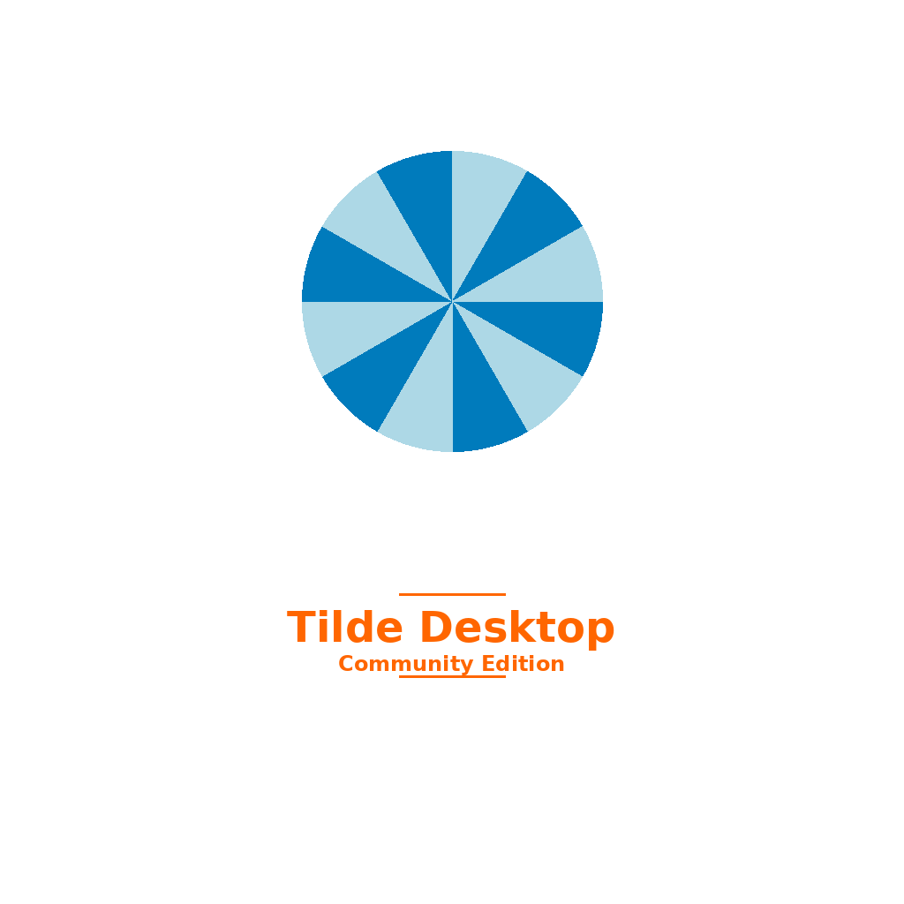

# Tilde Desktop



Tilde Desktop is a lightweight, customizable desktop environment designed for Unix, macOS, and Linux. It offers a clean, efficient, and minimalist interface, perfect for users who prioritize simplicity without compromising on functionality.

---

## Key Features

- **Cross-Platform Support**: Works seamlessly on Unix, macOS, and Linux systems.
- **Lightweight**: Minimal system resource usage, ideal for older hardware and those who prefer a streamlined computing environment.
- **Customizable**: Easily adaptable to your needs with support for themes, extensions, and plugins.
- **Modern Technologies**: Developed using ANSI C, D, PHP, and Object Pascal (FreePascal) for performance and flexibility.
- **Open Source**: Licensed under an open-source license, inviting contributions and improvements from the community.

---

## Featured Tools

### Tilde Terminal


A powerful terminal emulator built for speed and ease of use. It supports custom themes and plugins to enhance productivity.

### Tilde File Manager


An efficient file manager with a dual-pane interface, allowing for quick file operations and easy navigation.

### Tilde Editor


A lightweight text editor that supports syntax highlighting, multiple programming languages, and various extensions for developers.

---

## Installation

You can install Tilde Desktop on supported platforms by following the steps below.

### Prerequisites

- A system running Unix, macOS, or Linux.
- [Git](https://git-scm.com/) installed to clone the repository.

### Steps

1. Clone the repository:
    ```bash
    git clone https://github.com/ringsce/tilde-desktop.git
    ```

2. Navigate to the project directory:
    ```bash
    cd tilde-desktop
    ```

3. Build the project (make sure you have the necessary compilers and build tools installed):
    ```bash
    make
    ```

4. Install the desktop environment:
    ```bash
    sudo make install
    ```

---

## Development

Tilde Desktop is a community-driven project, and contributions are highly encouraged. Whether you're interested in fixing bugs, adding features, or improving documentation, your help is welcome!

### How to Contribute

1. Fork the repository.
2. Create a new branch for your feature or bug fix.
3. Submit a pull request with a clear explanation of your changes.

---

## Community

Join the discussion, ask questions, or share your feedback:

- [Tilde Desktop Community Forum](https://example.com/forum)
- [GitHub Issues](https://github.com/ringsce/tilde-desktop/issues)

Stay up to date with new features and updates by following our blog and social channels:

- [Tilde Blog](https://ringscejs.gleentech.com/blog)
- [GitHub](https://github.com/ringsce)
- [Mastodon](https://mastodon.social/@ringsce)
- [X (Twitter)](https://twitter.com/ringsce)

---

## License

This project is licensed under the MIT License. See the [LICENSE](LICENSE) file for more details.

---

## Support

If you encounter any issues or need assistance with Tilde Desktop, feel free to open a GitHub issue or reach out to us via the community forum.

---


Integrating **Tilde Desktop** into AROS OS requires adapting its structure to AROS's unique platform, ensuring compatibility, and creating a modular approach. Here's how you can set up **Tilde Desktop** for AROS, along with utilizing the `amiga` folder for testing purposes.

---

### 1. **Setup and Folder Structure**
For simplicity, let's organize the files as follows:

```
tilde-desktop/
├── amiga/                  # Testing folder for Amiga/AROS
│   ├── tilde_main.c        # Entry point for Tilde Desktop on AROS
│   ├── gui.c               # AROS GUI abstraction layer
│   ├── file_manager.c      # Basic file manager code
│   ├── terminal.c          # Basic terminal emulator
│   ├── editor.c            # Text editor component
│   ├── tilde.h             # Shared header for components
│   └── Makefile            # Build instructions for AROS
├── src/                    # Main source files (for Unix/Linux/macOS)
└── ...
```

---

### 2. **AROS-Specific Files**

#### `tilde_main.c`
This file initializes the Tilde Desktop on AROS.

```c
#include "tilde.h"

int main(int argc, char **argv) {
    if (!init_gui()) {
        return 1;
    }

    run_file_manager(); // Launch file manager
    run_terminal();     // Launch terminal emulator
    run_editor();       // Launch text editor

    cleanup_gui();
    return 0;
}
```

---

#### `gui.c`
The GUI abstraction for AROS, using Intuition.

```c
#include "tilde.h"
#include <aros/intuition.h>

static struct Window *main_window;

int init_gui() {
    main_window = OpenWindowTags(NULL,
        WA_Title, (IPTR) "Tilde Desktop - AROS",
        WA_Width, 800,
        WA_Height, 600,
        WA_Flags, WFLG_CLOSEGADGET | WFLG_SIZEGADGET,
        TAG_END);

    return main_window != NULL;
}

void cleanup_gui() {
    if (main_window) {
        CloseWindow(main_window);
    }
}
```

---

#### `file_manager.c`
A placeholder for the file manager component.

```c
#include "tilde.h"

void run_file_manager() {
    printf("Running Tilde File Manager...\n");
    // Implement file manager logic here
}
```

---

#### `terminal.c`
A placeholder for the terminal emulator component.

```c
#include "tilde.h"

void run_terminal() {
    printf("Running Tilde Terminal Emulator...\n");
    // Implement terminal logic here
}
```

---

#### `editor.c`
A placeholder for the text editor component.

```c
#include "tilde.h"

void run_editor() {
    printf("Running Tilde Text Editor...\n");
    // Implement editor logic here
}
```

---

#### `tilde.h`
A shared header for all components.

```c
#ifndef TILDE_H
#define TILDE_H

#include <stdio.h>
#include <aros/intuition.h>

// GUI functions
int init_gui();
void cleanup_gui();

// Components
void run_file_manager();
void run_terminal();
void run_editor();

#endif
```

---

### 3. **Makefile**
Build the project for AROS using this `Makefile`.

```makefile
CC := gcc
CFLAGS := -Wall -O2
LDFLAGS := -lamiga -lintuition

SRC := tilde_main.c gui.c file_manager.c terminal.c editor.c
OBJ := $(SRC:.c=.o)
OUT := tilde_desktop

all: $(OUT)

$(OUT): $(OBJ)
	$(CC) $(OBJ) -o $@ $(LDFLAGS)

%.o: %.c
	$(CC) $(CFLAGS) -c $< -o $@

clean:
	rm -f $(OBJ) $(OUT)
```

---

### 4. **Using the `amiga` Folder**
The `amiga` folder is used for testing components specifically tailored for AROS. It contains:
- Simplified versions of Tilde Desktop components.
- A build system specific to AROS (the `Makefile` above).
- Debugging and logging for early testing.

You can gradually replace the placeholders with fully implemented components while testing them on AROS.

---

### 5. **Steps to Build and Test**
1. **Navigate to the `amiga` Folder**:
   ```bash
   cd tilde-desktop/amiga
   ```

2. **Build the Project**:
   ```bash
   make
   ```

3. **Test on AROS**:
   Transfer the `tilde_desktop` binary to your AROS environment and execute it.

---

### 6. **Future Enhancements**
- **UI Improvements**: Add menus, buttons, and other GUI elements to each component.
- **Feature Integration**: Implement full logic for the file manager, terminal emulator, and text editor.
- **Testing and Debugging**: Use the `amiga` folder for continuous testing and debugging on AROS.

---

This setup provides a foundation to port Tilde Desktop to AROS and test it incrementally. Let me know if you need help with specific features or additional integration steps!


**Kreatyve Designs**  
&copy; 2016 - 2025 Kreatyve Designs. All Rights Reserved.

